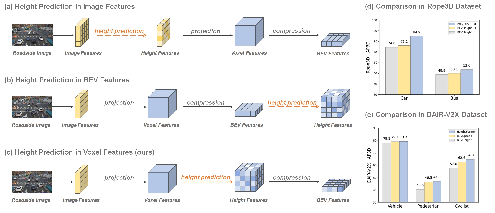

<p align="center">

  <h1 align="center">HeightFormer: Learning Height Prediction in Voxel Features for Roadside Vision Centric 3D Object Detection via Transformer</h1>
  
  </p>


[](https://opensource.org/licenses/MIT)
<!--
[](https://ieeexplore.ieee.org/document/11005676)
-->
[](https://arxiv.org/pdf/2503.10777)

<p align="center">

</p>
<p align="center">

</p>
<p align="center">

</p>

# Overview
HeightFormer is an efficient framework learning height prediction in voxel features via transformer. It groups the voxel features into local height sequences, and utilize attention mechanism to obtain height distribution prediction. Subsequently, the local height sequences are reassembled to generate accurate 3D features. The proposed method achieves the state-of-the-art in two large-scale real-world roadside visual perception benchmarks, DAIR-V2X-I and Rope3D. 

# Getting Started

- [Installation](docs/install.md)
- [Prepare Dataset](docs/prepare_dataset.md)

Train HeightFormer with 8 GPUs
```
python [EXP_PATH] --amp_backend native -b 8 --gpus 8
```
Eval HeightFormer with 1 GPU
```
python [EXP_PATH] --ckpt_path [CKPT_PATH] -e -b 1 --gpus 1
```

# Acknowledgment
This project is not possible without the following codebases.
* [Height3D](https://github.com/zhangzhang2024/Height3D) 
* [BEVHeight](https://github.com/ADLab-AutoDrive/BEVHeight)
* [DAIR-V2X](https://github.com/AIR-THU/DAIR-V2X)

# Citation
If you use HeightFormer in your research, please cite our work by using the following BibTeX entry:
```
@article{zhang2025heightformer,
  title={Heightformer: Learning height prediction in voxel features for roadside vision centric 3d object detection via transformer},
  author={Zhang, Zhang and Sun, Chao and Yue, Chao and Wen, Da and Chen, Yujie and Wang, Tianze and Leng, Jianghao},
  journal={arXiv preprint arXiv:2503.10777},
  year={2025}
}
```
